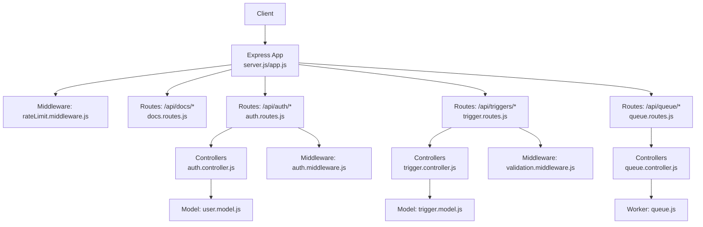
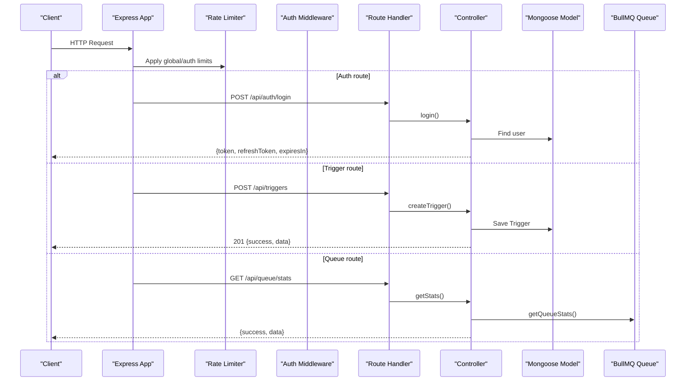
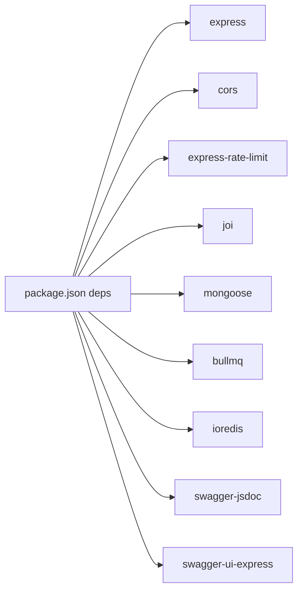
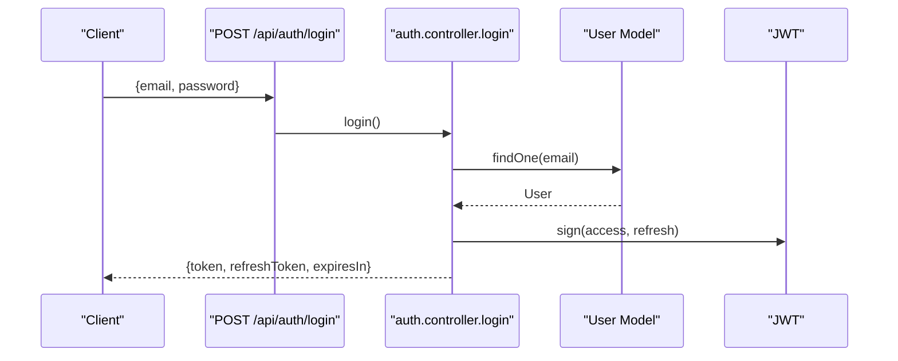
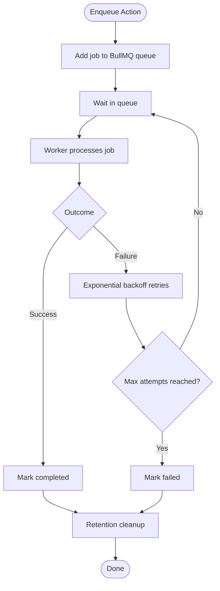

# API Reference

<cite>
**Referenced Files in This Document**
- [server.js](file://backend/src/server.js)
- [app.js](file://backend/src/app.js)
- [docs.routes.js](file://backend/src/routes/docs.routes.js)
- [auth.routes.js](file://backend/src/routes/auth.routes.js)
- [trigger.routes.js](file://backend/src/routes/trigger.routes.js)
- [queue.routes.js](file://backend/src/routes/queue.routes.js)
- [auth.controller.js](file://backend/src/controllers/auth.controller.js)
- [trigger.controller.js](file://backend/src/controllers/trigger.controller.js)
- [queue.controller.js](file://backend/src/controllers/queue.controller.js)
- [auth.middleware.js](file://backend/src/middleware/auth.middleware.js)
- [validation.middleware.js](file://backend/src/middleware/validation.middleware.js)
- [rateLimit.middleware.js](file://backend/src/middleware/rateLimit.middleware.js)
- [trigger.model.js](file://backend/src/models/trigger.model.js)
- [user.model.js](file://backend/src/models/user.model.js)
- [queue.js](file://backend/src/worker/queue.js)
- [appError.js](file://backend/src/utils/appError.js)
- [asyncHandler.js](file://backend/src/utils/asyncHandler.js)
- [package.json](file://backend/package.json)
</cite>

## Table of Contents
1. [Introduction](#introduction)
2. [Project Structure](#project-structure)
3. [Core Components](#core-components)
4. [Architecture Overview](#architecture-overview)
5. [Detailed Component Analysis](#detailed-component-analysis)
6. [Dependency Analysis](#dependency-analysis)
7. [Performance Considerations](#performance-considerations)
8. [Troubleshooting Guide](#troubleshooting-guide)
9. [Conclusion](#conclusion)
10. [Appendices](#appendices)

## Introduction
This document provides comprehensive API documentation for EventHorizon’s backend. It covers REST endpoints for trigger management, queue operations, health monitoring, and user authentication. It also documents OpenAPI/Swagger integration, interactive documentation, rate limiting, security, and client implementation guidelines.

## Project Structure
The backend is an Express application with modular routing, controllers, middleware, models, and workers. Routes are mounted under /api/* and expose:
- Health checks
- Authentication endpoints
- Trigger CRUD operations
- Queue administration endpoints
- OpenAPI/Swagger documentation

**Diagram sources**
- [server.js:1-88](file://backend/src/server.js#L1-L88)
- [app.js:1-55](file://backend/src/app.js#L1-L55)
- [docs.routes.js:1-164](file://backend/src/routes/docs.routes.js#L1-L164)
- [auth.routes.js:1-38](file://backend/src/routes/auth.routes.js#L1-L38)
- [trigger.routes.js:1-92](file://backend/src/routes/trigger.routes.js#L1-L92)
- [queue.routes.js:1-104](file://backend/src/routes/queue.routes.js#L1-L104)
- [auth.controller.js:1-82](file://backend/src/controllers/auth.controller.js#L1-L82)
- [trigger.controller.js:1-72](file://backend/src/controllers/trigger.controller.js#L1-L72)
- [queue.controller.js:1-142](file://backend/src/controllers/queue.controller.js#L1-L142)
- [auth.middleware.js:1-22](file://backend/src/middleware/auth.middleware.js#L1-L22)
- [validation.middleware.js:1-49](file://backend/src/middleware/validation.middleware.js#L1-L49)
- [rateLimit.middleware.js:1-51](file://backend/src/middleware/rateLimit.middleware.js#L1-L51)
- [trigger.model.js:1-80](file://backend/src/models/trigger.model.js#L1-L80)
- [user.model.js:1-20](file://backend/src/models/user.model.js#L1-L20)
- [queue.js:1-164](file://backend/src/worker/queue.js#L1-L164)

**Section sources**
- [server.js:15-32](file://backend/src/server.js#L15-L32)
- [app.js:24-48](file://backend/src/app.js#L24-L48)
- [docs.routes.js:120-164](file://backend/src/routes/docs.routes.js#L120-L164)

## Core Components
- Authentication: JWT-based admin login and refresh token flow.
- Triggers: Manage Soroban event triggers and associated actions.
- Queue: BullMQ-backed job queue for asynchronous actions with stats and maintenance.
- Health: Lightweight GET /api/health for service readiness.
- OpenAPI/Swagger: Interactive docs and JSON spec served under /api/docs.

**Section sources**
- [auth.controller.js:15-82](file://backend/src/controllers/auth.controller.js#L15-L82)
- [trigger.controller.js:6-72](file://backend/src/controllers/trigger.controller.js#L6-L72)
- [queue.controller.js:7-142](file://backend/src/controllers/queue.controller.js#L7-L142)
- [docs.routes.js:120-164](file://backend/src/routes/docs.routes.js#L120-L164)

## Architecture Overview

**Diagram sources**
- [server.js:15-32](file://backend/src/server.js#L15-L32)
- [rateLimit.middleware.js:31-45](file://backend/src/middleware/rateLimit.middleware.js#L31-L45)
- [auth.middleware.js:5-22](file://backend/src/middleware/auth.middleware.js#L5-L22)
- [auth.controller.js:15-82](file://backend/src/controllers/auth.controller.js#L15-L82)
- [trigger.controller.js:6-28](file://backend/src/controllers/trigger.controller.js#L6-L28)
- [queue.controller.js:7-21](file://backend/src/controllers/queue.controller.js#L7-L21)
- [queue.js:126-143](file://backend/src/worker/queue.js#L126-L143)

## Detailed Component Analysis

### Health Monitoring
- Endpoint: GET /api/health
- Description: Confirms API availability.
- Authentication: Not required.
- Rate limiting: Subject to global limiter.
- Responses:
  - 200 OK: Returns a simple object indicating the service is healthy.

**Section sources**
- [server.js:20-32](file://backend/src/server.js#L20-L32)
- [app.js:28-48](file://backend/src/app.js#L28-L48)

### Authentication
- Base path: /api/auth
- Endpoints:
  - POST /api/auth/login
    - Purpose: Admin login to obtain access and refresh tokens.
    - Authentication: None.
    - Request body:
      - email: string, required, email format
      - password: string, required, min length 8
    - Response:
      - 200 OK: { token, refreshToken, expiresIn }
      - 401 Unauthorized: Invalid credentials.
      - 500 Internal Server Error: Unexpected error.
    - Validation: Joi schema enforces email/password constraints.
    - Security:
      - Access token lifetime is short-lived.
      - Refresh token is used to obtain a new access token.
  - POST /api/auth/refresh
    - Purpose: Obtain a new access token using a valid refresh token.
    - Authentication: None.
    - Request body:
      - refreshToken: string, required
    - Response:
      - 200 OK: { token, expiresIn }
      - 400/401 Unauthorized: Missing or invalid refresh token.
      - 500 Internal Server Error: Unexpected error.

- JWT configuration:
  - Secrets are loaded from environment variables.
  - Access token expires in 1 hour; refresh token expires in 7 days.

**Section sources**
- [auth.routes.js:5-36](file://backend/src/routes/auth.routes.js#L5-L36)
- [auth.controller.js:15-82](file://backend/src/controllers/auth.controller.js#L15-L82)
- [validation.middleware.js:12-16](file://backend/src/middleware/validation.middleware.js#L12-L16)
- [auth.middleware.js:5-22](file://backend/src/middleware/auth.middleware.js#L5-L22)

### Trigger Management
- Base path: /api/triggers
- Endpoints:
  - POST /api/triggers
    - Purpose: Create a new trigger.
    - Authentication: Requires Bearer token.
    - Request body (validated):
      - contractId: string, required
      - eventName: string, required
      - actionType: enum [webhook, discord, email], default webhook
      - actionUrl: string, URI, required
      - isActive: boolean, default true
      - lastPolledLedger: number, default 0
    - Response:
      - 201 Created: { success: true, data: Trigger }
      - 400 Bad Request: Validation errors with details.
      - 500 Internal Server Error: Unexpected error.
    - Notes:
      - Validation middleware applies Joi schema.
      - Async error handling wraps controller logic.
  - GET /api/triggers
    - Purpose: List all triggers.
    - Authentication: Requires Bearer token.
    - Response:
      - 200 OK: { success: true, data: [Trigger] }
      - 500 Internal Server Error: Unexpected error.
  - DELETE /api/triggers/{id}
    - Purpose: Delete a trigger by MongoDB ObjectId.
    - Authentication: Requires Bearer token.
    - Path parameters:
      - id: string, required (MongoDB ObjectId)
    - Response:
      - 204 No Content: Success.
      - 404 Not Found: Trigger not found.
      - 500 Internal Server Error: Unexpected error.

- Data model (selected fields):
  - contractId: string, indexed
  - eventName: string
  - actionType: enum [webhook, discord, email, telegram]
  - actionUrl: string
  - isActive: boolean
  - lastPolledLedger: number
  - retryConfig: { maxRetries, retryIntervalMs }
  - metadata: Map<String,String>
  - timestamps: createdAt, updatedAt
  - Virtuals: healthScore (0–100), healthStatus ("healthy","degraded","critical")

**Section sources**
- [trigger.routes.js:9-92](file://backend/src/routes/trigger.routes.js#L9-L92)
- [trigger.controller.js:6-72](file://backend/src/controllers/trigger.controller.js#L6-L72)
- [validation.middleware.js:3-16](file://backend/src/middleware/validation.middleware.js#L3-L16)
- [auth.middleware.js:5-22](file://backend/src/middleware/auth.middleware.js#L5-L22)
- [trigger.model.js:3-79](file://backend/src/models/trigger.model.js#L3-L79)

### Queue Operations
- Base path: /api/queue
- Notes:
  - Queue endpoints are guarded by a runtime availability check. If Redis/BullMQ is not available, the system responds with 503 and directs to documentation.
- Endpoints:
  - GET /api/queue/stats
    - Purpose: Retrieve queue statistics (waiting, active, completed, failed, delayed).
    - Authentication: Requires Bearer token.
    - Response:
      - 200 OK: { success: true, data: { waiting, active, completed, failed, delayed, total } }
      - 503 Service Unavailable: Queue system not available.
  - GET /api/queue/jobs
    - Purpose: Fetch jobs filtered by status with pagination.
    - Authentication: Requires Bearer token.
    - Query parameters:
      - status: enum [waiting, active, completed, failed, delayed], default completed
      - limit: integer, default 50
    - Response:
      - 200 OK: { success: true, data: { status, count, jobs: [...] } }
      - 400 Bad Request: Invalid status.
      - 503 Service Unavailable: Queue system not available.
  - POST /api/queue/clean
    - Purpose: Clean old jobs (completed older than 24h, failed older than 7d).
    - Authentication: Requires Bearer token.
    - Response:
      - 200 OK: { success: true, message: "Queue cleaned successfully" }
      - 503 Service Unavailable: Queue system not available.
  - POST /api/queue/jobs/{jobId}/retry
    - Purpose: Retry a failed job by jobId.
    - Authentication: Requires Bearer token.
    - Path parameters:
      - jobId: string, required
    - Response:
      - 200 OK: { success: true, message: "Job retry initiated", data: { jobId } }
      - 404 Not Found: Job not found.
      - 503 Service Unavailable: Queue system not available.

**Section sources**
- [queue.routes.js:13-104](file://backend/src/routes/queue.routes.js#L13-L104)
- [queue.controller.js:7-142](file://backend/src/controllers/queue.controller.js#L7-L142)
- [queue.js:126-163](file://backend/src/worker/queue.js#L126-L163)

### OpenAPI and Interactive Documentation
- Base path: /api/docs
- Endpoints:
  - GET /api/docs/openapi.json
    - Returns the raw OpenAPI 3.0.3 specification as JSON.
  - GET /api/docs/
    - Serves Swagger UI with the OpenAPI spec.
    - Includes tag groups: Health, Triggers, Auth.
    - Server URL is derived from API_BASE_URL or defaults to http://localhost:PORT.

- Schema components included:
  - Trigger, TriggerInput, AuthCredentials, AuthTokenResponse, ErrorResponse.

**Section sources**
- [docs.routes.js:120-164](file://backend/src/routes/docs.routes.js#L120-L164)

## Dependency Analysis

**Diagram sources**
- [package.json:10-26](file://backend/package.json#L10-L26)

**Section sources**
- [package.json:10-26](file://backend/package.json#L10-L26)

## Performance Considerations
- Global rate limiting:
  - Window and max requests configurable via environment variables.
  - Default: 120 requests per 15 minutes per IP.
- Auth-specific rate limiting:
  - Separate window and max for /api/auth endpoints.
  - Default: 20 attempts per 15 minutes.
- Queue tuning:
  - BullMQ default job attempts: 3 with exponential backoff.
  - Completed/failed jobs retention controlled by removeOnComplete/removeOnFail.
- Recommendations:
  - Use pagination (limit) for listing jobs.
  - Batch clean operations sparingly.
  - Monitor healthScore and healthStatus on triggers to detect degradation early.

[No sources needed since this section provides general guidance]

## Troubleshooting Guide
- Authentication failures:
  - 401 Unauthorized: Missing or malformed Authorization header.
  - 401 Unauthorized: Invalid or expired token.
  - 400/401 Unauthorized: Missing or invalid refresh token during refresh.
- Validation errors:
  - 400 Bad Request: Validation failed with details array indicating field and message.
- Queue unavailability:
  - 503 Service Unavailable: Queue system disabled (no Redis/BullMQ). Check Redis configuration and logs.
- App errors:
  - Controllers use async wrapper and AppError; non-4xx errors return generic 500 with error message.

**Section sources**
- [auth.middleware.js:5-22](file://backend/src/middleware/auth.middleware.js#L5-L22)
- [validation.middleware.js:18-41](file://backend/src/middleware/validation.middleware.js#L18-L41)
- [queue.routes.js:14-23](file://backend/src/routes/queue.routes.js#L14-L23)
- [appError.js:1-16](file://backend/src/utils/appError.js#L1-L16)

## Conclusion
EventHorizon exposes a focused set of REST endpoints for managing triggers, authenticating administrators, inspecting queue state, and health checks. OpenAPI/Swagger provides interactive documentation and JSON spec. Rate limiting and JWT-based auth protect endpoints, while BullMQ enables robust asynchronous processing. Clients should respect rate limits, handle 503 for queue unavailability, and use the provided schemas for request payloads.

[No sources needed since this section summarizes without analyzing specific files]

## Appendices

### Endpoint Catalog
- Health
  - GET /api/health
- Authentication
  - POST /api/auth/login
  - POST /api/auth/refresh
- Triggers
  - POST /api/triggers
  - GET /api/triggers
  - DELETE /api/triggers/{id}
- Queue
  - GET /api/queue/stats
  - GET /api/queue/jobs
  - POST /api/queue/clean
  - POST /api/queue/jobs/{jobId}/retry
- Documentation
  - GET /api/docs/openapi.json
  - GET /api/docs/

**Section sources**
- [server.js:20-32](file://backend/src/server.js#L20-L32)
- [auth.routes.js:26-36](file://backend/src/routes/auth.routes.js#L26-L36)
- [trigger.routes.js:57-89](file://backend/src/routes/trigger.routes.js#L57-L89)
- [queue.routes.js:25-101](file://backend/src/routes/queue.routes.js#L25-L101)
- [docs.routes.js:155-162](file://backend/src/routes/docs.routes.js#L155-L162)

### Request/Response Schemas

- TriggerInput
  - contractId: string
  - eventName: string
  - actionType: enum ["webhook","discord","email"], default "webhook"
  - actionUrl: string (URI)
  - isActive: boolean, default true
  - lastPolledLedger: number, default 0

- Trigger (as stored)
  - Fields: contractId, eventName, actionType, actionUrl, isActive, lastPolledLedger, retryConfig, metadata, timestamps, healthScore (virtual), healthStatus (virtual)

- AuthCredentials
  - email: string (email)
  - password: string (min length 8)

- AuthTokenResponse
  - token: string (access)
  - refreshToken: string
  - expiresIn: integer (seconds)

- ErrorResponse
  - error: string

**Section sources**
- [docs.routes.js:11-118](file://backend/src/routes/docs.routes.js#L11-L118)
- [trigger.model.js:3-79](file://backend/src/models/trigger.model.js#L3-L79)
- [validation.middleware.js:3-16](file://backend/src/middleware/validation.middleware.js#L3-L16)

### Authentication Flow

**Diagram sources**
- [auth.routes.js:26](file://backend/src/routes/auth.routes.js#L26)
- [auth.controller.js:15-52](file://backend/src/controllers/auth.controller.js#L15-L52)
- [user.model.js:3-18](file://backend/src/models/user.model.js#L3-L18)

### Rate Limiting Behavior
- Global limiter applies to most routes.
- Auth limiter applies to /api/auth endpoints.
- On limit hit:
  - 429 Too Many Requests with success=false, message, retryAfterSeconds.

**Section sources**
- [rateLimit.middleware.js:31-45](file://backend/src/middleware/rateLimit.middleware.js#L31-L45)

### Queue Data Flow

**Diagram sources**
- [queue.js:91-121](file://backend/src/worker/queue.js#L91-L121)
- [queue.js:126-163](file://backend/src/worker/queue.js#L126-L163)

### Client Implementation Guidelines
- Authentication:
  - Send Authorization: Bearer <token> for protected endpoints.
  - Use /api/auth/refresh to renew access tokens.
- Validation:
  - Match schemas precisely (Joi constraints).
- Rate limits:
  - Implement client-side backoff using retryAfterSeconds.
- Queue operations:
  - Expect 503 when Redis is not configured.
  - Use limit parameter to constrain job listings.
- Error handling:
  - Parse success/error fields and details array for validation errors.

[No sources needed since this section provides general guidance]