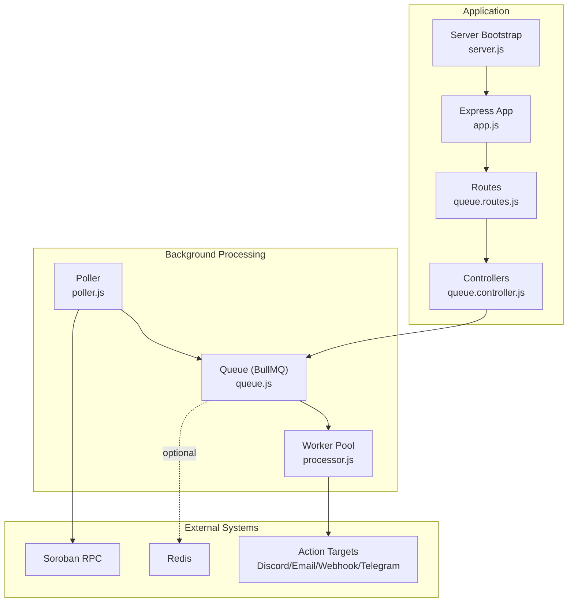
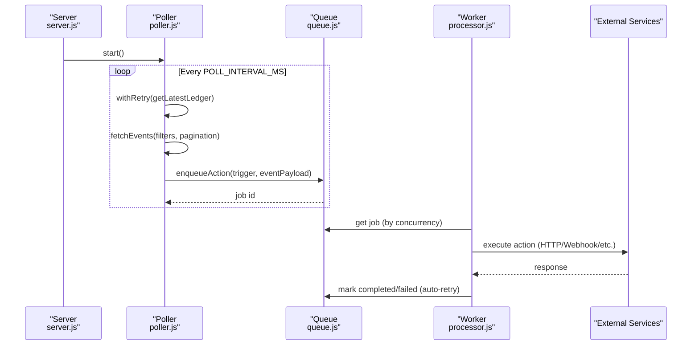
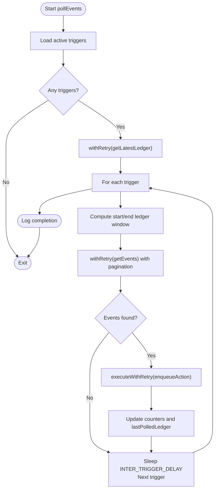
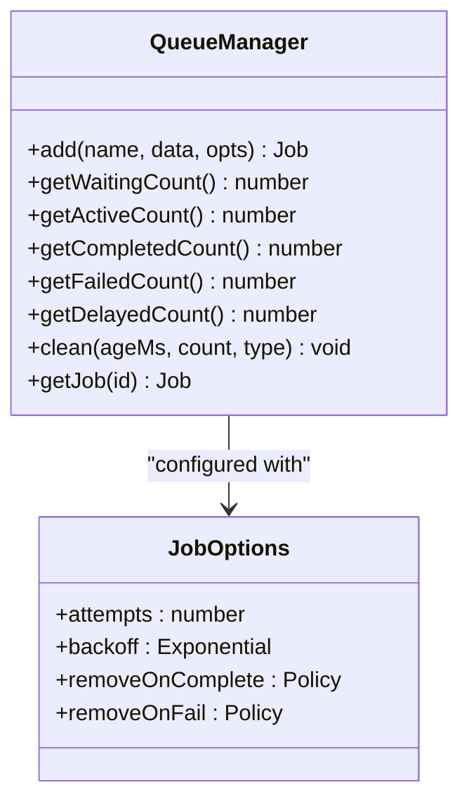
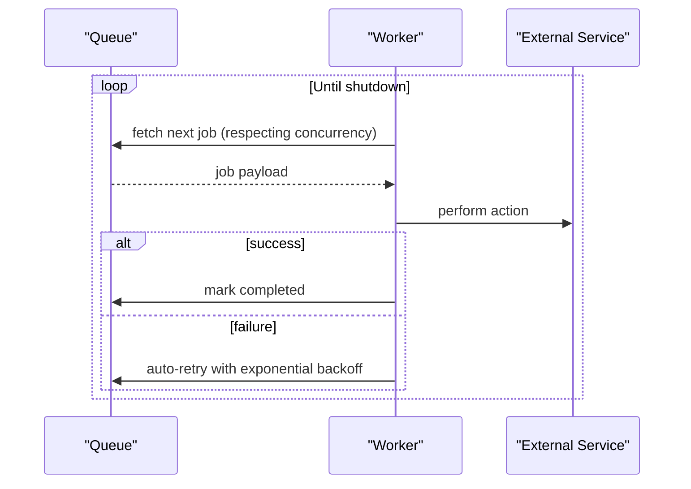
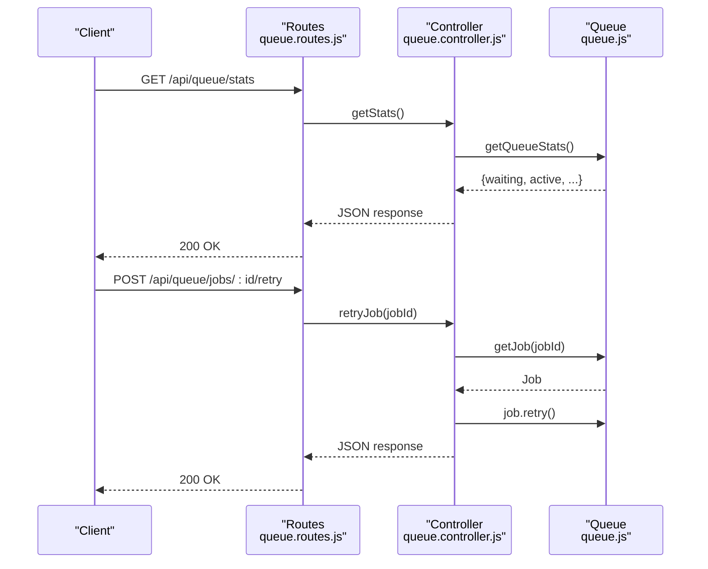
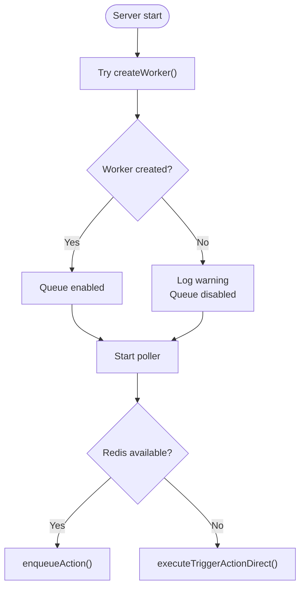
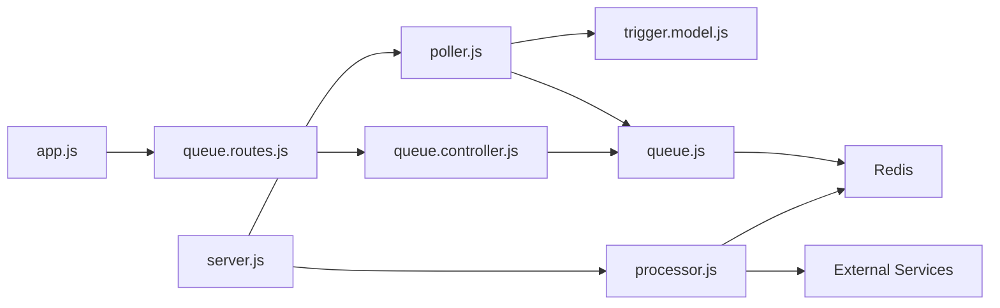

# Background Processing Architecture

<cite>
**Referenced Files in This Document**
- [poller.js](file://backend/src/worker/poller.js)
- [processor.js](file://backend/src/worker/processor.js)
- [queue.js](file://backend/src/worker/queue.js)
- [queue.controller.js](file://backend/src/controllers/queue.controller.js)
- [queue.routes.js](file://backend/src/routes/queue.routes.js)
- [server.js](file://backend/src/server.js)
- [app.js](file://backend/src/app.js)
- [trigger.model.js](file://backend/src/models/trigger.model.js)
- [queue-usage.js](file://backend/examples/queue-usage.js)
- [QUICKSTART_QUEUE.md](file://backend/QUICKSTART_QUEUE.md)
- [REDIS_OPTIONAL.md](file://backend/REDIS_OPTIONAL.md)
- [CHANGELOG_QUEUE.md](file://backend/CHANGELOG_QUEUE.md)
- [package.json](file://backend/package.json)
</cite>

## Table of Contents
1. [Introduction](#introduction)
2. [Project Structure](#project-structure)
3. [Core Components](#core-components)
4. [Architecture Overview](#architecture-overview)
5. [Detailed Component Analysis](#detailed-component-analysis)
6. [Dependency Analysis](#dependency-analysis)
7. [Performance Considerations](#performance-considerations)
8. [Troubleshooting Guide](#troubleshooting-guide)
9. [Conclusion](#conclusion)
10. [Appendices](#appendices)

## Introduction
This document explains the background processing architecture that powers event-driven actions in the system. It covers the event polling mechanism with exponential backoff, the BullMQ-based queue system, retry strategies for failed jobs, worker concurrency controls, and monitoring capabilities. It also documents the optional Redis dependency, graceful fallback behavior, scaling considerations, practical examples, and performance optimization techniques.

## Project Structure
The background processing system spans three primary layers:
- Event detection and queuing: handled by the poller
- Job queue and persistence: handled by BullMQ and Redis
- Worker execution and retries: handled by the worker pool

**Diagram sources**
- [server.js:1-88](file://backend/src/server.js#L1-L88)
- [app.js:1-55](file://backend/src/app.js#L1-L55)
- [queue.routes.js:1-104](file://backend/src/routes/queue.routes.js#L1-L104)
- [queue.controller.js:1-142](file://backend/src/controllers/queue.controller.js#L1-L142)
- [poller.js:1-335](file://backend/src/worker/poller.js#L1-L335)
- [queue.js:1-164](file://backend/src/worker/queue.js#L1-L164)
- [processor.js:1-174](file://backend/src/worker/processor.js#L1-L174)

**Section sources**
- [server.js:1-88](file://backend/src/server.js#L1-L88)
- [app.js:1-55](file://backend/src/app.js#L1-L55)
- [queue.routes.js:1-104](file://backend/src/routes/queue.routes.js#L1-L104)
- [queue.controller.js:1-142](file://backend/src/controllers/queue.controller.js#L1-L142)
- [poller.js:1-335](file://backend/src/worker/poller.js#L1-L335)
- [queue.js:1-164](file://backend/src/worker/queue.js#L1-L164)
- [processor.js:1-174](file://backend/src/worker/processor.js#L1-L174)

## Core Components
- Event Poller: Periodically queries the Soroban network for contract events, enqueues actions, and tracks per-trigger statistics.
- BullMQ Queue: Redis-backed job queue with exponential backoff, retention policies, and monitoring APIs.
- Worker Pool: Concurrency-controlled job processors that execute actions against external services.
- Queue Controller and Routes: Expose queue statistics, job listings, cleaning, and retry operations.

Key behaviors:
- Poller uses exponential backoff for RPC calls and paginates events with inter-page delays.
- Actions are enqueued with priority derived from trigger configuration.
- Worker applies rate limiting and configurable concurrency.
- Graceful fallback to direct execution when Redis is unavailable.

**Section sources**
- [poller.js:177-310](file://backend/src/worker/poller.js#L177-L310)
- [queue.js:19-41](file://backend/src/worker/queue.js#L19-L41)
- [processor.js:102-168](file://backend/src/worker/processor.js#L102-L168)
- [queue.controller.js:7-141](file://backend/src/controllers/queue.controller.js#L7-L141)

## Architecture Overview
The system separates concerns across layers to improve reliability and scalability:
- Poller detects events and enqueues jobs without blocking.
- Queue persists jobs and manages retries with exponential backoff.
- Worker pool executes jobs concurrently with rate limiting.
- Optional Redis enables background processing; without Redis, actions execute directly.

**Diagram sources**
- [server.js:44-58](file://backend/src/server.js#L44-L58)
- [poller.js:177-310](file://backend/src/worker/poller.js#L177-L310)
- [queue.js:91-121](file://backend/src/worker/queue.js#L91-L121)
- [processor.js:102-168](file://backend/src/worker/processor.js#L102-L168)

## Detailed Component Analysis

### Event Poller: Exponential Backoff and Sliding Window
The poller:
- Retrieves the latest ledger with exponential backoff for RPC calls.
- Computes a sliding window per trigger bounded by a maximum ledger range.
- Paginates events with inter-page delays to avoid rate limits.
- Enqueues actions with trigger-specific retry configuration.
- Updates per-trigger state only on successful cycles.

**Diagram sources**
- [poller.js:177-310](file://backend/src/worker/poller.js#L177-L310)

**Section sources**
- [poller.js:177-310](file://backend/src/worker/poller.js#L177-L310)
- [poller.js:27-51](file://backend/src/worker/poller.js#L27-L51)
- [poller.js:152-173](file://backend/src/worker/poller.js#L152-L173)

### BullMQ Queue: Configuration and Retries
The queue:
- Uses Redis-backed BullMQ with default job options including attempts and exponential backoff.
- Applies retention policies for completed and failed jobs.
- Exposes helpers to enqueue actions with priority and job identifiers.
- Provides queue statistics and cleanup routines.

**Diagram sources**
- [queue.js:19-41](file://backend/src/worker/queue.js#L19-L41)
- [queue.js:91-121](file://backend/src/worker/queue.js#L91-L121)

**Section sources**
- [queue.js:19-41](file://backend/src/worker/queue.js#L19-L41)
- [queue.js:91-121](file://backend/src/worker/queue.js#L91-L121)
- [queue.js:126-143](file://backend/src/worker/queue.js#L126-L143)
- [queue.js:148-156](file://backend/src/worker/queue.js#L148-L156)

### Worker Pool: Concurrency and Rate Limiting
The worker:
- Creates a BullMQ Worker bound to the Redis connection.
- Executes jobs with a concurrency level controlled by an environment variable.
- Applies a built-in rate limiter to cap throughput.
- Emits events for completed, failed, and error conditions.

**Diagram sources**
- [processor.js:102-168](file://backend/src/worker/processor.js#L102-L168)

**Section sources**
- [processor.js:102-168](file://backend/src/worker/processor.js#L102-L168)

### Queue Monitoring and Management APIs
The queue controller and routes:
- Provide endpoints to retrieve queue statistics, list jobs by status, clean old jobs, and retry failed jobs.
- Guard endpoints with availability checks when Redis is not configured.

**Diagram sources**
- [queue.routes.js:13-101](file://backend/src/routes/queue.routes.js#L13-L101)
- [queue.controller.js:7-141](file://backend/src/controllers/queue.controller.js#L7-L141)
- [queue.js:126-143](file://backend/src/worker/queue.js#L126-L143)

**Section sources**
- [queue.routes.js:13-101](file://backend/src/routes/queue.routes.js#L13-L101)
- [queue.controller.js:7-141](file://backend/src/controllers/queue.controller.js#L7-L141)

### Optional Redis and Fallback Behavior
The system gracefully degrades when Redis is unavailable:
- Worker initialization is attempted during server bootstrap; on failure, the system logs a warning and proceeds.
- The poller dynamically selects between enqueueing actions or executing them directly.
- Queue-related API endpoints return a service unavailable response when Redis is not configured.

**Diagram sources**
- [server.js:44-58](file://backend/src/server.js#L44-L58)
- [poller.js:55-147](file://backend/src/worker/poller.js#L55-L147)
- [queue.routes.js:13-23](file://backend/src/routes/queue.routes.js#L13-L23)

**Section sources**
- [server.js:44-58](file://backend/src/server.js#L44-L58)
- [poller.js:55-147](file://backend/src/worker/poller.js#L55-L147)
- [REDIS_OPTIONAL.md:1-203](file://backend/REDIS_OPTIONAL.md#L1-L203)

## Dependency Analysis
- BullMQ and ioredis are optional dependencies; the application remains functional without them.
- The poller depends on the Stellar SDK for RPC interactions and on the trigger model for configuration.
- The worker depends on Redis connectivity and external services for action execution.

**Diagram sources**
- [poller.js:1-10](file://backend/src/worker/poller.js#L1-L10)
- [trigger.model.js:1-80](file://backend/src/models/trigger.model.js#L1-L80)
- [queue.js:1-3](file://backend/src/worker/queue.js#L1-L3)
- [processor.js:1-7](file://backend/src/worker/processor.js#L1-L7)
- [queue.controller.js:1](file://backend/src/controllers/queue.controller.js#L1)
- [queue.routes.js:1-11](file://backend/src/routes/queue.routes.js#L1-L11)
- [server.js:44-58](file://backend/src/server.js#L44-L58)
- [app.js:27](file://backend/src/app.js#L27)

**Section sources**
- [package.json:10-22](file://backend/package.json#L10-L22)
- [poller.js:1-10](file://backend/src/worker/poller.js#L1-L10)
- [trigger.model.js:1-80](file://backend/src/models/trigger.model.js#L1-L80)
- [queue.js:1-3](file://backend/src/worker/queue.js#L1-L3)
- [processor.js:1-7](file://backend/src/worker/processor.js#L1-L7)
- [queue.controller.js:1](file://backend/src/controllers/queue.controller.js#L1)
- [queue.routes.js:1-11](file://backend/src/routes/queue.routes.js#L1-L11)
- [server.js:44-58](file://backend/src/server.js#L44-L58)
- [app.js:27](file://backend/src/app.js#L27)

## Performance Considerations
- Polling cadence: Tune POLL_INTERVAL_MS to balance responsiveness and RPC load.
- Ledger window: MAX_LEDGERS_PER_POLL caps the scanning range per cycle; adjust based on activity and latency.
- Inter-delays: INTER_PAGE_DELAY_MS and INTER_TRIGGER_DELAY_MS prevent rate limiting and spread load.
- Worker concurrency: Increase WORKER_CONCURRENCY to improve throughput; ensure external services can handle the load.
- Rate limiting: The worker’s built-in limiter (10/second) prevents bursts; adjust if needed.
- Retention: Completed jobs are kept for 24 hours and failed for 7 days; tune to control Redis memory usage.
- Memory: Expect modest Redis overhead; monitor memory and consider cluster sizing for scale.

[No sources needed since this section provides general guidance]

## Troubleshooting Guide
Common issues and resolutions:
- Redis not running or misconfigured:
  - Symptoms: Worker fails to start; queue endpoints return service unavailable.
  - Resolution: Start Redis, verify connectivity, set REDIS_HOST/PORT/PASSWORD, and restart the server.
- Jobs stuck in waiting:
  - Cause: Worker not running or Redis unreachable.
  - Resolution: Ensure worker is started and Redis is reachable; restart the server if necessary.
- Slow external services:
  - Symptom: Increased queue backlog and long processing times.
  - Resolution: Scale workers, reduce concurrency, or optimize external service calls.
- Poller blocked by slow HTTP:
  - Behavior: Without Redis, poller blocks on HTTP calls.
  - Resolution: Enable Redis and the queue system to offload actions.
- Monitoring:
  - Use queue stats and job listing endpoints to inspect queue health and troubleshoot bottlenecks.

**Section sources**
- [QUICKSTART_QUEUE.md:144-181](file://backend/QUICKSTART_QUEUE.md#L144-L181)
- [REDIS_OPTIONAL.md:144-182](file://backend/REDIS_OPTIONAL.md#L144-L182)
- [queue.controller.js:7-141](file://backend/src/controllers/queue.controller.js#L7-L141)

## Conclusion
The background processing architecture cleanly separates event detection from action execution, leveraging BullMQ and Redis for reliability, scalability, and observability. The optional Redis design allows safe deployment without Redis, with graceful fallback to direct execution. With proper tuning of polling intervals, worker concurrency, and retention policies, the system can efficiently handle event-driven actions while maintaining resilience and performance.

[No sources needed since this section summarizes without analyzing specific files]

## Appendices

### Practical Examples
- Enqueueing actions and monitoring the queue:
  - See [queue-usage.js:1-223](file://backend/examples/queue-usage.js#L1-L223) for enqueueing jobs, retrieving stats, and inspecting job details.
- Queue setup quick start:
  - See [QUICKSTART_QUEUE.md:1-253](file://backend/QUICKSTART_QUEUE.md#L1-L253) for installation, configuration, and testing steps.
- Optional Redis behavior:
  - See [REDIS_OPTIONAL.md:1-203](file://backend/REDIS_OPTIONAL.md#L1-L203) for behavior differences and upgrade strategies.

**Section sources**
- [queue-usage.js:1-223](file://backend/examples/queue-usage.js#L1-L223)
- [QUICKSTART_QUEUE.md:1-253](file://backend/QUICKSTART_QUEUE.md#L1-L253)
- [REDIS_OPTIONAL.md:1-203](file://backend/REDIS_OPTIONAL.md#L1-L203)

### Relationship Between Polling Intervals, Job Priorities, and Resource Utilization
- Polling interval:
  - Shorter intervals increase responsiveness but raise RPC and CPU usage.
  - Longer intervals reduce load but may delay action execution.
- Job priorities:
  - Higher-priority triggers enqueue earlier; ensure worker capacity matches priority distribution.
- Resource utilization:
  - Concurrency and rate limiting directly impact CPU and network usage.
  - Retention policies influence Redis memory footprint; adjust based on operational needs.

**Section sources**
- [poller.js:312-329](file://backend/src/worker/poller.js#L312-L329)
- [queue.js:91-121](file://backend/src/worker/queue.js#L91-L121)
- [processor.js:128-136](file://backend/src/worker/processor.js#L128-L136)
- [CHANGELOG_QUEUE.md:180-192](file://backend/CHANGELOG_QUEUE.md#L180-L192)