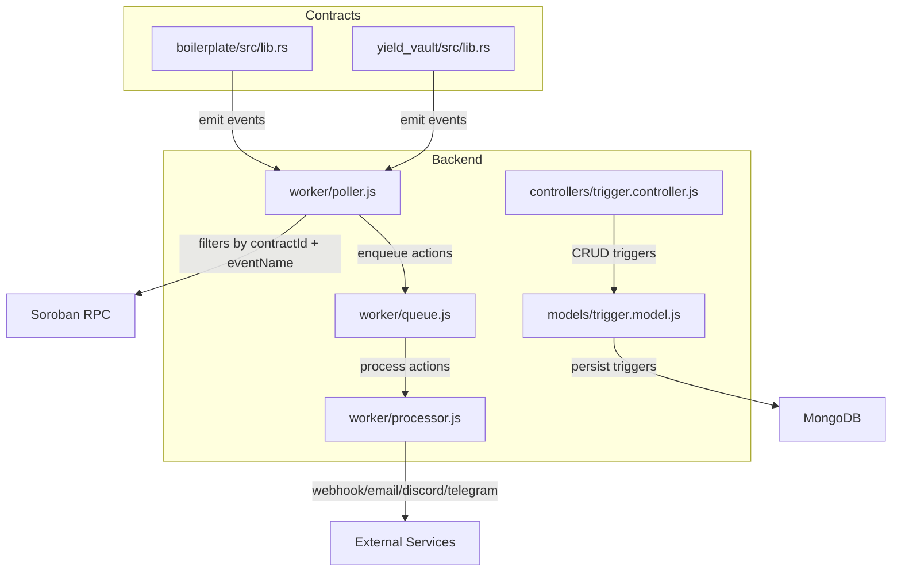
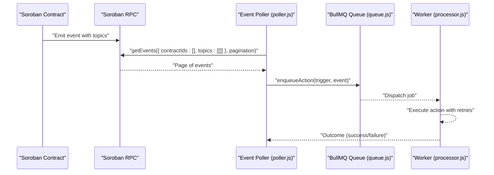
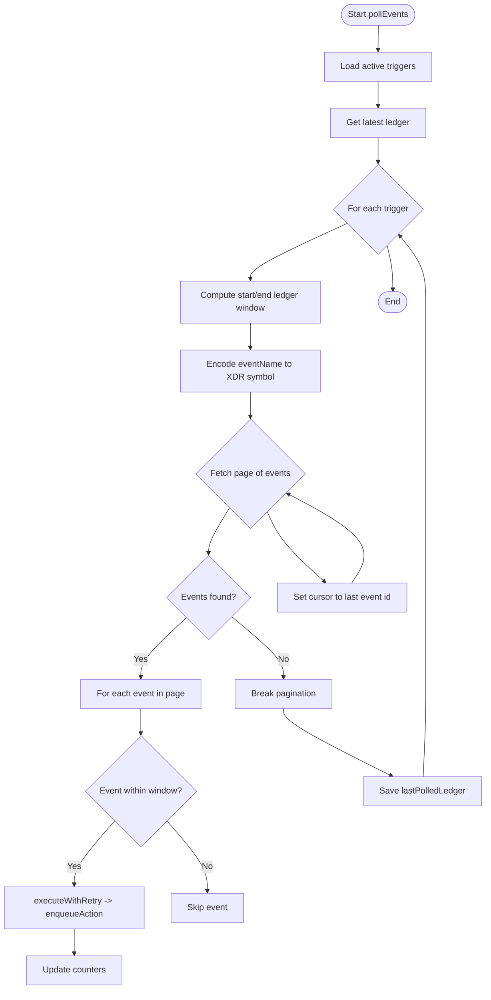
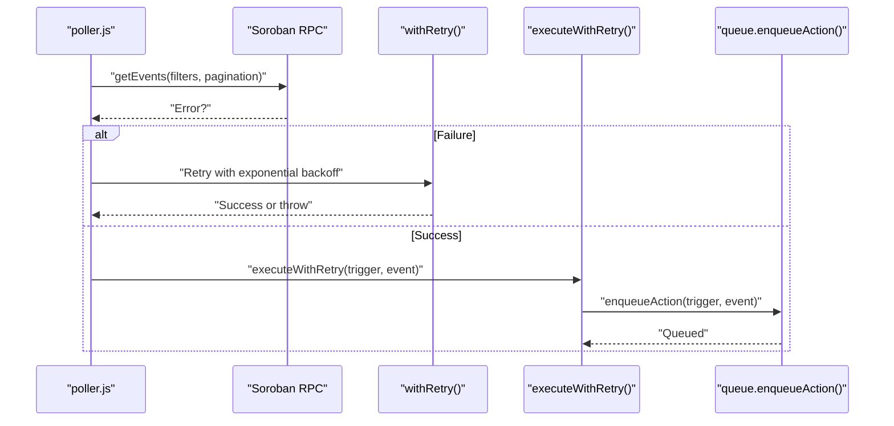
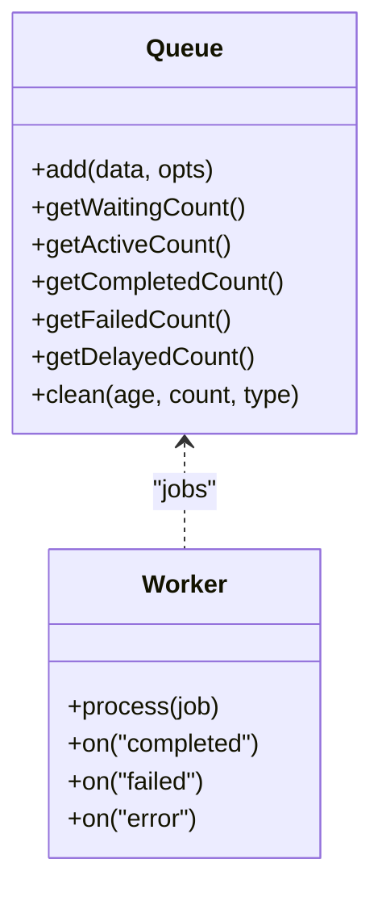
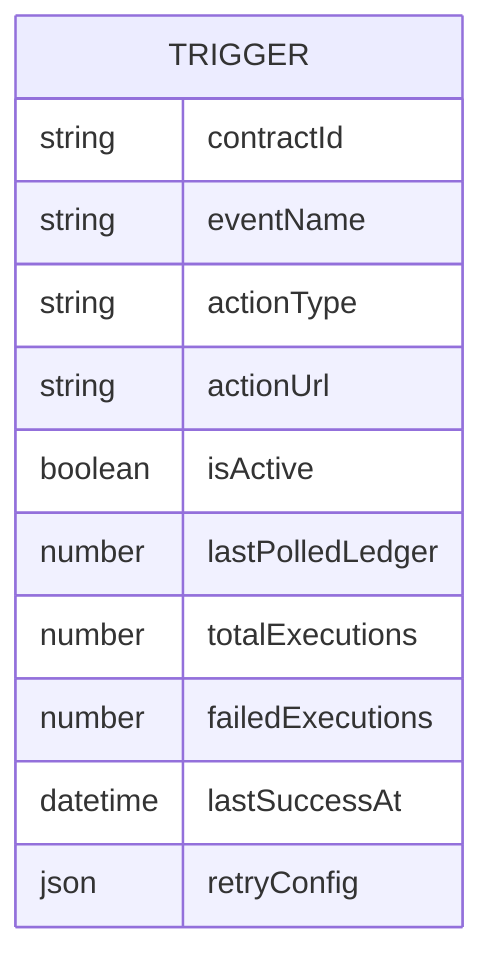
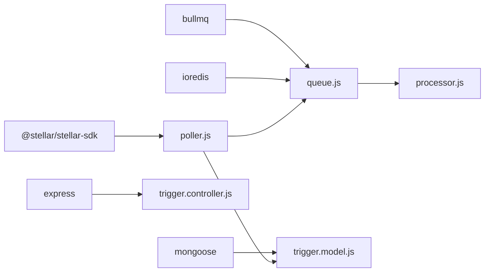

# Smart Contract Integration

<cite>
**Referenced Files in This Document**
- [poller.js](file://backend/src/worker/poller.js)
- [queue.js](file://backend/src/worker/queue.js)
- [processor.js](file://backend/src/worker/processor.js)
- [trigger.model.js](file://backend/src/models/trigger.model.js)
- [trigger.controller.js](file://backend/src/controllers/trigger.controller.js)
- [lib.rs (boilerplate)](file://contracts/boilerplate/src/lib.rs)
- [test.rs (boilerplate)](file://contracts/boilerplate/src/test.rs)
- [lib.rs (yield_vault)](file://contracts/yield_vault/src/lib.rs)
- [README.md](file://README.md)
- [REDIS_OPTIONAL.md](file://backend/REDIS_OPTIONAL.md)
- [QUEUE_SETUP.md](file://backend/QUEUE_SETUP.md)
- [package.json](file://backend/package.json)
</cite>

## Table of Contents
1. [Introduction](#introduction)
2. [Project Structure](#project-structure)
3. [Core Components](#core-components)
4. [Architecture Overview](#architecture-overview)
5. [Detailed Component Analysis](#detailed-component-analysis)
6. [Dependency Analysis](#dependency-analysis)
7. [Performance Considerations](#performance-considerations)
8. [Troubleshooting Guide](#troubleshooting-guide)
9. [Conclusion](#conclusion)
10. [Appendices](#appendices)

## Introduction
This document explains how EventHorizon integrates with Soroban smart contracts to listen for on-chain events and trigger Web2 actions. It covers event emission patterns in Rust contracts, topic-based filtering via Soroban RPC, pagination support for event retrieval, and the implementation of the event poller worker including exponential backoff and retry strategies. It also documents contract deployment procedures, testing methodologies using the boilerplate contract, and event monitoring configuration. Practical examples are linked to actual code locations to guide integration.

## Project Structure
EventHorizon comprises:
- A backend that polls Soroban for contract events and dispatches actions
- A set of example contracts demonstrating event emission patterns
- A React frontend for managing triggers (outside the scope of this document)

**Diagram sources**
- [poller.js:177-310](file://backend/src/worker/poller.js#L177-L310)
- [queue.js:91-121](file://backend/src/worker/queue.js#L91-L121)
- [processor.js:25-96](file://backend/src/worker/processor.js#L25-L96)
- [trigger.model.js:3-62](file://backend/src/models/trigger.model.js#L3-L62)
- [trigger.controller.js:6-28](file://backend/src/controllers/trigger.controller.js#L6-L28)
- [lib.rs (boilerplate):8-14](file://contracts/boilerplate/src/lib.rs#L8-L14)
- [lib.rs (yield_vault):25-51](file://contracts/yield_vault/src/lib.rs#L25-L51)

**Section sources**
- [README.md:10-17](file://README.md#L10-L17)
- [package.json:10-22](file://backend/package.json#L10-L22)

## Core Components
- Event poller worker: queries Soroban RPC for contract events, applies topic-based filters, paginates results, and enqueues actions.
- Queue and worker: optional background processing with retries and concurrency control.
- Trigger model and controller: define and manage event triggers and their retry behavior.
- Example contracts: demonstrate event emission patterns compatible with EventHorizon’s filter semantics.

**Section sources**
- [poller.js:177-310](file://backend/src/worker/poller.js#L177-L310)
- [queue.js:91-121](file://backend/src/worker/queue.js#L91-L121)
- [processor.js:25-96](file://backend/src/worker/processor.js#L25-L96)
- [trigger.model.js:3-62](file://backend/src/models/trigger.model.js#L3-L62)
- [trigger.controller.js:6-28](file://backend/src/controllers/trigger.controller.js#L6-L28)
- [lib.rs (boilerplate):8-14](file://contracts/boilerplate/src/lib.rs#L8-L14)
- [lib.rs (yield_vault):25-51](file://contracts/yield_vault/src/lib.rs#L25-L51)

## Architecture Overview
EventHorizon’s integration architecture consists of:
- Contracts emitting events with topics
- Poller querying Soroban RPC with contractId and eventName filters
- Pagination and per-trigger ledger windows
- Optional queueing and worker execution with retries

**Diagram sources**
- [poller.js:227-277](file://backend/src/worker/poller.js#L227-L277)
- [queue.js:91-121](file://backend/src/worker/queue.js#L91-L121)
- [processor.js:25-96](file://backend/src/worker/processor.js#L25-L96)

## Detailed Component Analysis

### Event Emission Patterns in Soroban Contracts
- Topic-based events: Contracts publish events with topics that EventHorizon can filter by. The boilerplate contract emits a symbol-based topic, while the yield vault defines typed events.
- Typed events: The yield vault demonstrates structured events (e.g., Deposit, Withdraw, YieldAccrued, RebalanceSignal) suitable for robust filtering and parsing.

Practical example locations:
- Emitting a symbol topic event: [lib.rs (boilerplate):11-14](file://contracts/boilerplate/src/lib.rs#L11-L14)
- Defining typed events: [lib.rs (yield_vault):25-51](file://contracts/yield_vault/src/lib.rs#L25-L51)

**Section sources**
- [lib.rs (boilerplate):8-14](file://contracts/boilerplate/src/lib.rs#L8-L14)
- [lib.rs (yield_vault):25-51](file://contracts/yield_vault/src/lib.rs#L25-L51)

### Topic-Based Filtering and Event Retrieval
- Filter construction: The poller builds a filter with contractId and a topics array containing the encoded event name (converted to XDR symbol).
- Pagination: The poller iterates pages using the last event id as a cursor until fewer than the page size is returned.
- Ledger windowing: For each trigger, the poller computes a sliding window from lastPolledLedger to the network tip, capped by a configurable maximum.

**Diagram sources**
- [poller.js:177-310](file://backend/src/worker/poller.js#L177-L310)

**Section sources**
- [poller.js:204-298](file://backend/src/worker/poller.js#L204-L298)

### Pagination Support for Event Retrieval
- Page size: The poller requests up to 100 events per page.
- Cursor-based pagination: Uses the last event id from a page to fetch the next page.
- Inter-page delay: A small delay prevents rate limiting against the RPC.

**Section sources**
- [poller.js:227-277](file://backend/src/worker/poller.js#L227-L277)

### Event Poller Worker Implementation Details
- RPC configuration: Timeout and RPC URL are configurable.
- Retry with exponential backoff: Network errors, 429, and 5xx are retried with exponential backoff.
- Trigger-level retries: Each action execution supports configurable maxRetries and retryIntervalMs.
- Direct vs queue execution: If Redis is unavailable, actions execute synchronously with limited retry behavior.

**Diagram sources**
- [poller.js:27-51](file://backend/src/worker/poller.js#L27-L51)
- [poller.js:152-173](file://backend/src/worker/poller.js#L152-L173)
- [poller.js:227-277](file://backend/src/worker/poller.js#L227-L277)
- [queue.js:91-121](file://backend/src/worker/queue.js#L91-L121)

**Section sources**
- [poller.js:5-16](file://backend/src/worker/poller.js#L5-L16)
- [poller.js:27-51](file://backend/src/worker/poller.js#L27-L51)
- [poller.js:152-173](file://backend/src/worker/poller.js#L152-L173)
- [poller.js:312-329](file://backend/src/worker/poller.js#L312-L329)

### Queue and Worker: Background Processing and Retries
- Queue: Persistent job storage via Redis with default retry attempts and exponential backoff.
- Worker: Concurrent processing with rate limiting and logging; handles action execution per trigger type.
- Fallback behavior: Without Redis, the poller executes actions directly with minimal retry logic.

**Diagram sources**
- [queue.js:19-83](file://backend/src/worker/queue.js#L19-L83)
- [processor.js:102-167](file://backend/src/worker/processor.js#L102-L167)

**Section sources**
- [queue.js:19-83](file://backend/src/worker/queue.js#L19-L83)
- [processor.js:102-167](file://backend/src/worker/processor.js#L102-L167)
- [REDIS_OPTIONAL.md:1-203](file://backend/REDIS_OPTIONAL.md#L1-L203)

### Trigger Model and Controller
- Trigger schema: Stores contractId, eventName, actionType, actionUrl, activation flag, lastPolledLedger, and execution statistics.
- Retry configuration: Per-trigger retry settings override defaults.
- CRUD endpoints: Create, list, and delete triggers.

**Diagram sources**
- [trigger.model.js:3-62](file://backend/src/models/trigger.model.js#L3-L62)

**Section sources**
- [trigger.model.js:3-62](file://backend/src/models/trigger.model.js#L3-L62)
- [trigger.controller.js:6-28](file://backend/src/controllers/trigger.controller.js#L6-L28)

### Contract Deployment and Testing Using the Boilerplate
- Deployment: Build and deploy the boilerplate contract using the Soroban CLI.
- Testing: Use the built-in test to verify event emission.
- Integration: Add a trigger with the contractId and event name, emit the event from the contract, and observe the backend action.

Practical example locations:
- Emitting an event: [lib.rs (boilerplate):11-14](file://contracts/boilerplate/src/lib.rs#L11-L14)
- Verifying emission in tests: [test.rs (boilerplate):7-16](file://contracts/boilerplate/src/test.rs#L7-L16)
- Integration steps: [README.md:57-62](file://README.md#L57-L62)

**Section sources**
- [lib.rs (boilerplate):8-14](file://contracts/boilerplate/src/lib.rs#L8-L14)
- [test.rs (boilerplate):7-16](file://contracts/boilerplate/src/test.rs#L7-L16)
- [README.md:57-62](file://README.md#L57-L62)

## Dependency Analysis
- Backend runtime dependencies include the Stellar SDK for RPC, BullMQ and ioredis for queueing, and Express for HTTP.
- The poller depends on the trigger model for configuration and on the queue/worker for action execution.
- Contracts depend on the Soroban SDK for event emission.

**Diagram sources**
- [package.json:10-22](file://backend/package.json#L10-L22)
- [poller.js:1-8](file://backend/src/worker/poller.js#L1-L8)
- [trigger.model.js](file://backend/src/models/trigger.model.js#L1)
- [trigger.controller.js](file://backend/src/controllers/trigger.controller.js#L1)
- [queue.js:1-3](file://backend/src/worker/queue.js#L1-L3)
- [processor.js:1-7](file://backend/src/worker/processor.js#L1-L7)

**Section sources**
- [package.json:10-22](file://backend/package.json#L10-L22)

## Performance Considerations
- Polling cadence: Tune POLL_INTERVAL_MS to balance responsiveness and RPC load.
- Window size: Adjust MAX_LEDGERS_PER_POLL to control per-cycle scanning breadth.
- Backoff and retries: The poller and action execution both use exponential backoff to handle transient failures.
- Queue concurrency: Increase WORKER_CONCURRENCY to improve throughput when Redis is available.
- Rate limiting: The worker includes a built-in rate limiter to avoid overwhelming external services.
- Pagination delays: INTER_PAGE_DELAY_MS helps avoid RPC throttling.

[No sources needed since this section provides general guidance]

## Troubleshooting Guide
Common issues and resolutions:
- Redis not available: The system gracefully falls back to direct execution. Install and configure Redis to enable background processing.
- RPC timeouts or rate limits: The poller retries with exponential backoff; verify RPC_TIMEOUT_MS and network connectivity.
- Action failures: Inspect worker logs for error details; ensure actionUrl and credentials are correct.
- Queue stuck jobs: Use the queue API endpoints to inspect and retry failed jobs.

**Section sources**
- [REDIS_OPTIONAL.md:1-203](file://backend/REDIS_OPTIONAL.md#L1-L203)
- [poller.js:27-51](file://backend/src/worker/poller.js#L27-L51)
- [processor.js:145-151](file://backend/src/worker/processor.js#L145-L151)
- [QUEUE_SETUP.md:204-228](file://backend/QUEUE_SETUP.md#L204-L228)

## Conclusion
EventHorizon provides a robust, extensible framework for integrating Soroban smart contracts with Web2 systems. By leveraging topic-based event filtering, pagination-aware retrieval, and optional background job processing with retries, it ensures reliable automation across diverse contract designs. The boilerplate and example contracts illustrate practical patterns for emitting events, while the poller and queue components offer scalable, observable operation.

[No sources needed since this section summarizes without analyzing specific files]

## Appendices

### Practical Examples Index
- Emitting a symbol topic event: [lib.rs (boilerplate):11-14](file://contracts/boilerplate/src/lib.rs#L11-L14)
- Emitting typed events: [lib.rs (yield_vault):93-148](file://contracts/yield_vault/src/lib.rs#L93-L148)
- Polling and filtering: [poller.js:227-277](file://backend/src/worker/poller.js#L227-L277)
- Enqueueing actions: [queue.js:91-121](file://backend/src/worker/queue.js#L91-L121)
- Executing actions: [processor.js:25-96](file://backend/src/worker/processor.js#L25-L96)
- Creating triggers: [trigger.controller.js:6-28](file://backend/src/controllers/trigger.controller.js#L6-L28)
- Trigger persistence: [trigger.model.js:3-62](file://backend/src/models/trigger.model.js#L3-L62)

**Section sources**
- [lib.rs (boilerplate):8-14](file://contracts/boilerplate/src/lib.rs#L8-L14)
- [lib.rs (yield_vault):93-148](file://contracts/yield_vault/src/lib.rs#L93-L148)
- [poller.js:227-277](file://backend/src/worker/poller.js#L227-L277)
- [queue.js:91-121](file://backend/src/worker/queue.js#L91-L121)
- [processor.js:25-96](file://backend/src/worker/processor.js#L25-L96)
- [trigger.controller.js:6-28](file://backend/src/controllers/trigger.controller.js#L6-L28)
- [trigger.model.js:3-62](file://backend/src/models/trigger.model.js#L3-L62)