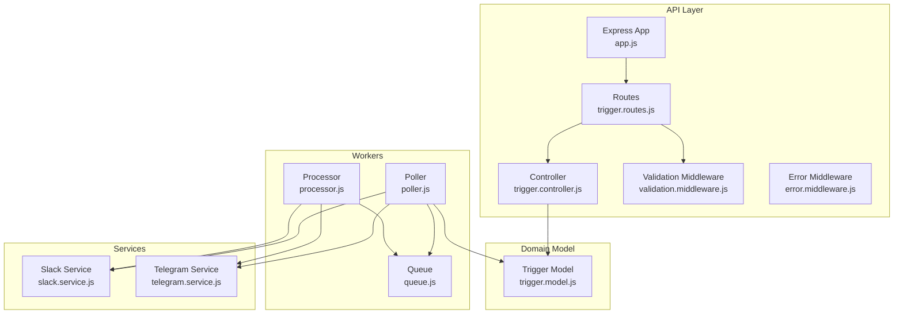
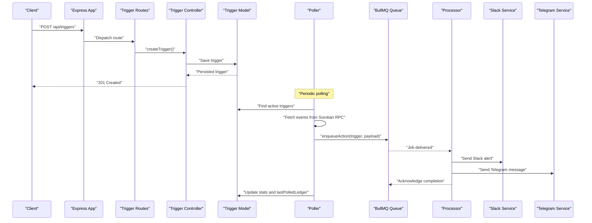
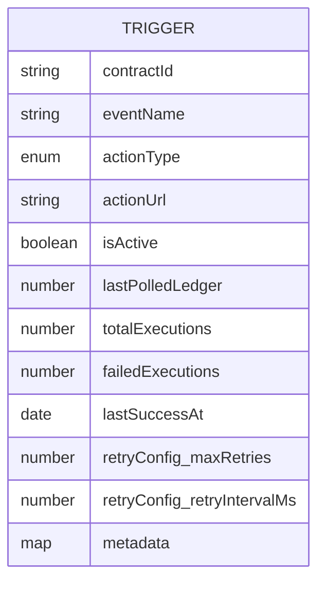
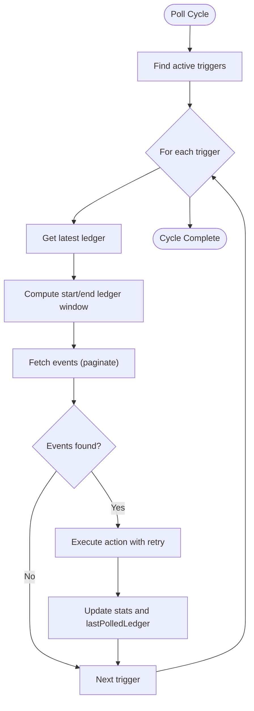
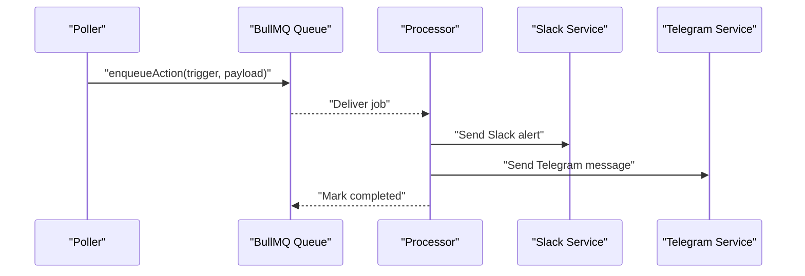
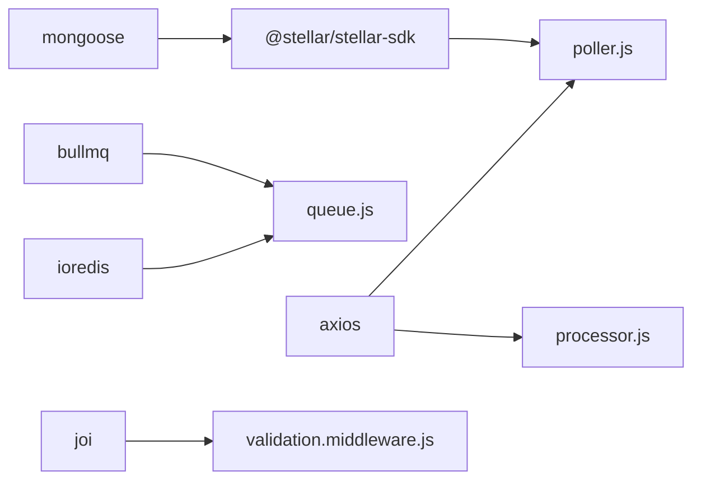

# Trigger Management System

<cite>
**Referenced Files in This Document**
- [trigger.model.js](file://backend/src/models/trigger.model.js)
- [trigger.controller.js](file://backend/src/controllers/trigger.controller.js)
- [trigger.routes.js](file://backend/src/routes/trigger.routes.js)
- [validation.middleware.js](file://backend/src/middleware/validation.middleware.js)
- [error.middleware.js](file://backend/src/middleware/error.middleware.js)
- [poller.js](file://backend/src/worker/poller.js)
- [processor.js](file://backend/src/worker/processor.js)
- [queue.js](file://backend/src/worker/queue.js)
- [slack.service.js](file://backend/src/services/slack.service.js)
- [telegram.service.js](file://backend/src/services/telegram.service.js)
- [app.js](file://backend/src/app.js)
- [queue-usage.js](file://backend/examples/queue-usage.js)
- [trigger.controller.test.js](file://backend/__tests__/trigger.controller.test.js)
- [package.json](file://backend/package.json)
</cite>

## Table of Contents
1. [Introduction](#introduction)
2. [Project Structure](#project-structure)
3. [Core Components](#core-components)
4. [Architecture Overview](#architecture-overview)
5. [Detailed Component Analysis](#detailed-component-analysis)
6. [Dependency Analysis](#dependency-analysis)
7. [Performance Considerations](#performance-considerations)
8. [Troubleshooting Guide](#troubleshooting-guide)
9. [Conclusion](#conclusion)
10. [Appendices](#appendices)

## Introduction
This document explains the Trigger Management System that monitors Soroban contract events and executes configured actions (webhook, Slack, Telegram, Discord, email). It covers the complete lifecycle from creation to deletion, activation/deactivation workflows, bulk operations, the trigger model schema, controller implementation, validation and error handling, practical configuration examples, optimization and monitoring, and the relationship with the queue system for asynchronous processing.

## Project Structure
The trigger system spans models, controllers, routes, middleware, workers, services, and queue infrastructure. The backend is an Express application that exposes REST endpoints for triggers and integrates with a polling worker and optional BullMQ queue.

**Diagram sources**
- [app.js:1-55](file://backend/src/app.js#L1-L55)
- [trigger.routes.js:1-92](file://backend/src/routes/trigger.routes.js#L1-L92)
- [trigger.controller.js:1-72](file://backend/src/controllers/trigger.controller.js#L1-L72)
- [validation.middleware.js:1-49](file://backend/src/middleware/validation.middleware.js#L1-L49)
- [error.middleware.js:1-59](file://backend/src/middleware/error.middleware.js#L1-L59)
- [trigger.model.js:1-80](file://backend/src/models/trigger.model.js#L1-L80)
- [poller.js:1-335](file://backend/src/worker/poller.js#L1-L335)
- [processor.js:1-174](file://backend/src/worker/processor.js#L1-L174)
- [queue.js:1-164](file://backend/src/worker/queue.js#L1-L164)
- [slack.service.js:1-165](file://backend/src/services/slack.service.js#L1-L165)
- [telegram.service.js:1-74](file://backend/src/services/telegram.service.js#L1-L74)

**Section sources**
- [app.js:1-55](file://backend/src/app.js#L1-L55)
- [trigger.routes.js:1-92](file://backend/src/routes/trigger.routes.js#L1-L92)
- [trigger.controller.js:1-72](file://backend/src/controllers/trigger.controller.js#L1-L72)
- [trigger.model.js:1-80](file://backend/src/models/trigger.model.js#L1-L80)
- [poller.js:1-335](file://backend/src/worker/poller.js#L1-L335)
- [processor.js:1-174](file://backend/src/worker/processor.js#L1-L174)
- [queue.js:1-164](file://backend/src/worker/queue.js#L1-L164)
- [slack.service.js:1-165](file://backend/src/services/slack.service.js#L1-L165)
- [telegram.service.js:1-74](file://backend/src/services/telegram.service.js#L1-L74)

## Core Components
- Trigger Model: Defines schema, indexes, virtuals for health metrics, and metadata.
- Controller: Implements create, list, and delete operations with logging and error propagation.
- Routes: Exposes REST endpoints with OpenAPI comments and validation middleware.
- Validation Middleware: Uses Joi to validate incoming payloads.
- Error Middleware: Normalizes errors and responds consistently.
- Poller: Scans Soroban events, matches triggers, and dispatches actions with retries.
- Queue: Optional BullMQ queue for background processing with stats and cleanup.
- Processor: Worker that executes queued actions.
- Services: Integrations for Slack and Telegram notifications.

**Section sources**
- [trigger.model.js:1-80](file://backend/src/models/trigger.model.js#L1-L80)
- [trigger.controller.js:1-72](file://backend/src/controllers/trigger.controller.js#L1-L72)
- [trigger.routes.js:1-92](file://backend/src/routes/trigger.routes.js#L1-L92)
- [validation.middleware.js:1-49](file://backend/src/middleware/validation.middleware.js#L1-L49)
- [error.middleware.js:1-59](file://backend/src/middleware/error.middleware.js#L1-L59)
- [poller.js:1-335](file://backend/src/worker/poller.js#L1-L335)
- [queue.js:1-164](file://backend/src/worker/queue.js#L1-L164)
- [processor.js:1-174](file://backend/src/worker/processor.js#L1-L174)
- [slack.service.js:1-165](file://backend/src/services/slack.service.js#L1-L165)
- [telegram.service.js:1-74](file://backend/src/services/telegram.service.js#L1-L74)

## Architecture Overview
The system consists of:
- REST API for trigger CRUD
- Poller that queries Soroban RPC for events and executes actions
- Optional queue for background processing
- Services for external integrations

**Diagram sources**
- [app.js:1-55](file://backend/src/app.js#L1-L55)
- [trigger.routes.js:1-92](file://backend/src/routes/trigger.routes.js#L1-L92)
- [trigger.controller.js:1-72](file://backend/src/controllers/trigger.controller.js#L1-L72)
- [trigger.model.js:1-80](file://backend/src/models/trigger.model.js#L1-L80)
- [poller.js:1-335](file://backend/src/worker/poller.js#L1-L335)
- [queue.js:1-164](file://backend/src/worker/queue.js#L1-L164)
- [processor.js:1-174](file://backend/src/worker/processor.js#L1-L174)
- [slack.service.js:1-165](file://backend/src/services/slack.service.js#L1-L165)
- [telegram.service.js:1-74](file://backend/src/services/telegram.service.js#L1-L74)

## Detailed Component Analysis

### Trigger Model Schema and Health Metrics
The trigger model defines the structure and behavior of triggers, including:
- Identity: contractId, eventName
- Action: actionType (webhook, discord, email, telegram), actionUrl
- Control: isActive, lastPolledLedger
- Stats & Health: totalExecutions, failedExecutions, lastSuccessAt, healthScore virtual, healthStatus virtual
- Configuration: retryConfig (maxRetries, retryIntervalMs), metadata Map
- Indexes: contractId, metadata Map

Health metrics:
- healthScore: computed percentage of successful executions
- healthStatus: healthy/degraded/critical derived from healthScore

**Diagram sources**
- [trigger.model.js:3-79](file://backend/src/models/trigger.model.js#L3-L79)

**Section sources**
- [trigger.model.js:1-80](file://backend/src/models/trigger.model.js#L1-L80)

### Controller Implementation: CRUD Operations
- createTrigger: Logs creation, persists trigger, returns 201 with data
- getTriggers: Lists all triggers, logs count
- deleteTrigger: Removes by ID; throws 404 AppError if missing

Logging and error propagation:
- Uses asyncHandler to forward exceptions to error middleware
- Logs IP, user agent, and trigger identifiers for auditability

**Section sources**
- [trigger.controller.js:1-72](file://backend/src/controllers/trigger.controller.js#L1-L72)
- [error.middleware.js:1-59](file://backend/src/middleware/error.middleware.js#L1-L59)

### Routes and Validation
- POST /api/triggers: Validates payload using Joi schema, then invokes controller
- GET /api/triggers: Returns all triggers
- DELETE /api/triggers/:id: Deletes trigger by ID
- Validation schema enforces:
  - contractId, eventName required
  - actionType limited to supported values
  - actionUrl required and must be a URI
  - isActive defaults to true
  - lastPolledLedger defaults to 0

**Section sources**
- [trigger.routes.js:1-92](file://backend/src/routes/trigger.routes.js#L1-L92)
- [validation.middleware.js:1-49](file://backend/src/middleware/validation.middleware.js#L1-L49)

### Poller and Action Execution
Key responsibilities:
- Find active triggers
- Query Soroban RPC for events within a sliding ledger window per trigger
- Paginate and filter by contractId and event topic
- Dispatch actions via queue when enabled, or execute directly with retries
- Update lastPolledLedger and stats on success/failure

Retry strategy:
- Per-action retry with exponential backoff based on trigger.retryConfig
- Per-RPC request retry with exponential backoff for network and server errors

**Diagram sources**
- [poller.js:177-310](file://backend/src/worker/poller.js#L177-L310)

**Section sources**
- [poller.js:1-335](file://backend/src/worker/poller.js#L1-L335)

### Queue System and Background Processing
- Queue module wraps BullMQ Queue with default job options:
  - Attempts with exponential backoff
  - Cleanup policies for completed/failed jobs
- enqueueAction adds jobs with priority and unique job IDs
- getQueueStats reports waiting, active, completed, failed, delayed counts
- Processor consumes jobs concurrently with rate limiting and logs outcomes

**Diagram sources**
- [queue.js:1-164](file://backend/src/worker/queue.js#L1-L164)
- [processor.js:1-174](file://backend/src/worker/processor.js#L1-L174)
- [poller.js:55-147](file://backend/src/worker/poller.js#L55-L147)

**Section sources**
- [queue.js:1-164](file://backend/src/worker/queue.js#L1-L164)
- [processor.js:1-174](file://backend/src/worker/processor.js#L1-L174)
- [poller.js:55-147](file://backend/src/worker/poller.js#L55-L147)

### Services: Slack and Telegram
- SlackService builds rich Block Kit payloads and sends via webhook, handling rate limits and common errors.
- TelegramService sends MarkdownV2 messages and escapes special characters.

**Section sources**
- [slack.service.js:1-165](file://backend/src/services/slack.service.js#L1-L165)
- [telegram.service.js:1-74](file://backend/src/services/telegram.service.js#L1-L74)

### Practical Trigger Configuration Examples
Below are example configurations for different notification channels. Use these as templates when creating triggers via the API.

- Webhook
  - actionType: "webhook"
  - actionUrl: "https://your-service.com/webhooks/soroban"
  - contractId: "your-contract-id"
  - eventName: "SwapExecuted"

- Slack
  - actionType: "slack"
  - actionUrl: "https://hooks.slack.com/workflows/YOUR-WEBHOOK-ID"
  - contractId: "your-contract-id"
  - eventName: "TokensVested"

- Telegram
  - actionType: "telegram"
  - actionUrl: "YOUR_CHAT_ID" (chat ID stored in actionUrl)
  - contractId: "your-contract-id"
  - eventName: "StakeCreated"

Notes:
- For Slack, ensure the webhook URL is configured and the service can render rich blocks.
- For Telegram, ensure TELEGRAM_BOT_TOKEN is set and the chat ID is valid.

**Section sources**
- [queue-usage.js:9-85](file://backend/examples/queue-usage.js#L9-L85)
- [poller.js:114-131](file://backend/src/worker/poller.js#L114-L131)

### Activation/Deactivation and Bulk Operations
- Activation/Deactivation: Toggle isActive in the trigger record; only active triggers are polled.
- Bulk Operations:
  - List all triggers via GET /api/triggers
  - Delete individual triggers via DELETE /api/triggers/:id
  - For bulk updates, update records in bulk using the model and re-save; the poller reads isActive on each cycle.

**Section sources**
- [trigger.controller.js:30-71](file://backend/src/controllers/trigger.controller.js#L30-L71)
- [trigger.routes.js:57-89](file://backend/src/routes/trigger.routes.js#L57-L89)
- [trigger.model.js:22-25](file://backend/src/models/trigger.model.js#L22-L25)

### Error Handling Strategies
- Validation failures: Joi validation returns 400 with details
- Cast/unique/DB errors: Normalized via error middleware to consistent shape
- Route not found: 404 handled centrally
- Operational vs non-operational errors: Logged with stack traces in development

**Section sources**
- [validation.middleware.js:18-41](file://backend/src/middleware/validation.middleware.js#L18-L41)
- [error.middleware.js:5-30](file://backend/src/middleware/error.middleware.js#L5-L30)
- [error.middleware.js:32-53](file://backend/src/middleware/error.middleware.js#L32-L53)

## Dependency Analysis
External dependencies relevant to triggers:
- @stellar/stellar-sdk: Interacts with Soroban RPC
- bullmq/ioredis: Background queue and Redis connectivity
- axios: HTTP calls for webhooks and Telegram
- joi: Request validation
- mongoose: Trigger persistence

**Diagram sources**
- [package.json:10-22](file://backend/package.json#L10-L22)
- [poller.js:1-335](file://backend/src/worker/poller.js#L1-L335)
- [queue.js:1-164](file://backend/src/worker/queue.js#L1-L164)
- [processor.js:1-174](file://backend/src/worker/processor.js#L1-L174)
- [validation.middleware.js:1-49](file://backend/src/middleware/validation.middleware.js#L1-L49)
- [trigger.model.js:1-80](file://backend/src/models/trigger.model.js#L1-L80)

**Section sources**
- [package.json:10-22](file://backend/package.json#L10-L22)

## Performance Considerations
- Polling Window: Limits per-trigger scan to reduce RPC load and memory usage.
- Pagination: Fetches events in pages to avoid oversized responses.
- Delays: Inter-page and inter-trigger delays to respect rate limits.
- Queue Mode: Prefer queue mode for high-volume workloads; configure concurrency and backoff appropriately.
- Stats Tracking: Use healthScore and healthStatus to monitor reliability.
- Cleanup: Periodically clean completed/failed jobs to control queue size.

[No sources needed since this section provides general guidance]

## Troubleshooting Guide
Common issues and resolutions:
- Validation errors on create: Ensure contractId, eventName, actionType, and actionUrl conform to schema.
- Missing credentials for integrations:
  - Slack: Verify webhook URL is present.
  - Telegram: Ensure TELEGRAM_BOT_TOKEN and a valid chat ID are configured.
- Poller failures:
  - RPC connectivity or timeouts: Check SOROBAN_RPC_URL and network conditions.
  - Excessive rate limits: Reduce POLL_INTERVAL_MS or enable queue mode.
- Queue issues:
  - Redis connectivity: Verify REDIS_HOST/PORT/PASSWORD.
  - Backlog growth: Increase WORKER_CONCURRENCY or adjust job backoff.
- Monitoring:
  - Use queue stats to observe waiting/active/completed/failed counts.
  - Inspect job details and retry failed jobs via queue helpers.

**Section sources**
- [error.middleware.js:5-30](file://backend/src/middleware/error.middleware.js#L5-L30)
- [poller.js:27-51](file://backend/src/worker/poller.js#L27-L51)
- [queue.js:126-156](file://backend/src/worker/queue.js#L126-L156)
- [queue-usage.js:87-180](file://backend/examples/queue-usage.js#L87-L180)

## Conclusion
The Trigger Management System provides a robust pipeline to monitor Soroban events and deliver notifications through multiple channels. Its design emphasizes reliability with retries, observability via health metrics and queue stats, and scalability via background processing. Proper configuration of credentials, queue infrastructure, and polling parameters ensures efficient operation under varying loads.

[No sources needed since this section summarizes without analyzing specific files]

## Appendices

### API Endpoints Summary
- POST /api/triggers: Create a trigger with validation
- GET /api/triggers: List all triggers
- DELETE /api/triggers/:id: Delete a trigger by ID

**Section sources**
- [trigger.routes.js:57-89](file://backend/src/routes/trigger.routes.js#L57-L89)

### Testing Notes
- Controller tests validate success payload wrapping and error forwarding for missing resources.

**Section sources**
- [trigger.controller.test.js:16-59](file://backend/__tests__/trigger.controller.test.js#L16-L59)